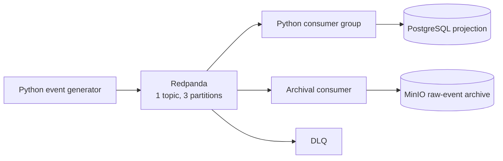

```mermaid
flowchart LR
    P[Python event generator] --> R[Redpanda<br/>1 topic, 3 partitions]
    R --> C[Python consumer group]
    C --> DB[(PostgreSQL projection)]
    R --> A[Archival consumer]
    A --> M[(MinIO raw-event archive)]
    R --> D[DLQ]
```